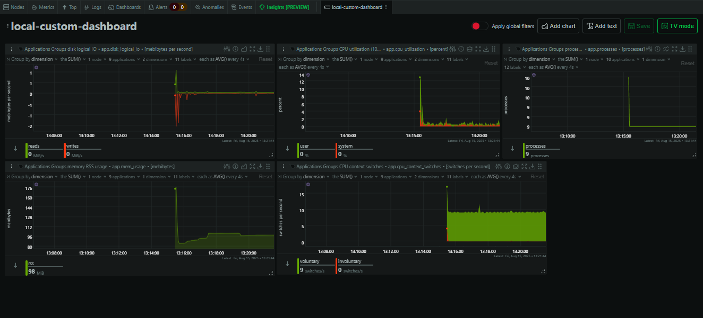
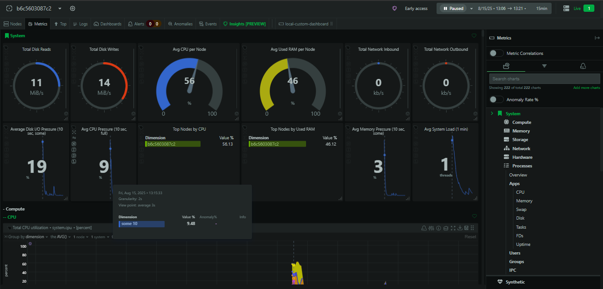
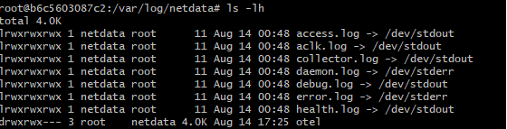

# Task 7 - Monitor System Resources Using Netdata

## 📌 Objective

Install **Netdata** on an AWS EC2 instance using Docker and visualize system and application performance metrics in real time.

---

## 🛠 Tools Used

* **AWS EC2 (Ubuntu 22.04)**
* **Docker**
* **Netdata (Docker image: `netdata/netdata`)**
* **Stress** (to simulate CPU load)
* **Apache2** (to simulate network activity)

---

## 📋 Steps Followed

1. **Connected to EC2 instance**

   ```bash
   ssh -i your-key.pem ubuntu@your-ec2-public-ip
   ```

2. **Installed Docker**

   ```bash
   sudo apt update
   sudo apt install -y docker.io
   sudo systemctl start docker
   sudo systemctl enable docker
   ```

3. **Ran Netdata container**

   ```bash
   sudo docker run -d --name=netdata \
     -p 19999:19999 \
     --cap-add SYS_PTRACE \
     --security-opt apparmor=unconfined \
     netdata/netdata
   ```

4. **Allowed inbound traffic for port 19999** in AWS EC2 Security Group.

5. **Accessed Netdata dashboard**

   ```
   http://<EC2-Public-IP>:19999
   ```

6. **Simulated system load for better visual metrics**

   ```bash
   sudo apt update && sudo apt install -y stress apache2 && \
   sudo systemctl start apache2 && \
   ( stress --cpu 2 --timeout 40 & ) && \
   ( dd if=/dev/zero of=testfile bs=1M count=200 && rm testfile & ) && \
   for i in {1..20}; do curl -s http://localhost > /dev/null; sleep 1; done
   ```

7. **Checked Netdata logs inside container**

   ```bash
   sudo docker exec -it netdata bash
   cd /var/log/netdata
   ls -lh
   cat netdata.log | tail -n 20
   exit
   ```

---

## 📸 Screenshots

**Netdata Dashboard:**


**CPU, Memory, Disk metrics:**


**Netdata Logs:**


---

## 💡 Interview Questions & Answers

**1. What does Netdata monitor?**
Netdata monitors real-time system and application performance metrics such as CPU usage, memory, disk I/O, network traffic, running processes, and container performance.

**2. How do you view real-time metrics?**
By accessing the Netdata web dashboard at `http://<server-ip>:19999`.

**3. How is Netdata different from Prometheus?**

* **Netdata** → Focuses on real-time per-second monitoring with interactive dashboards.
* **Prometheus** → Focuses on historical data storage and querying, often paired with Grafana.

**4. What is a collector?**
A module that gathers specific performance data from a source (e.g., CPU, MySQL, Docker).

**5. What are some performance KPIs to watch?**
CPU usage, memory utilization, disk I/O, network throughput, and application-specific metrics.

**6. How to deploy Netdata on a VM?**
Install Docker, run the Netdata container, open port 19999, and access via browser.

**7. How does Netdata alerting work?**
Uses built-in health monitoring with thresholds that trigger alerts via integrations like email, Slack, etc.

**8. What is a dashboard in this context?**
A real-time web interface showing system and app performance metrics.

---

## 📂 Repository Structure

```
├── README.md
├── dashboard.png
├── metrics.png
└── logs.png
```

---

## ✅ Outcome

* Successfully deployed **Netdata** on EC2 using Docker.
* Visualized CPU, memory, disk, and network metrics in real time.
* Learned how to monitor and simulate system load for testing.
* Captured screenshots for documentation and submission.

---
